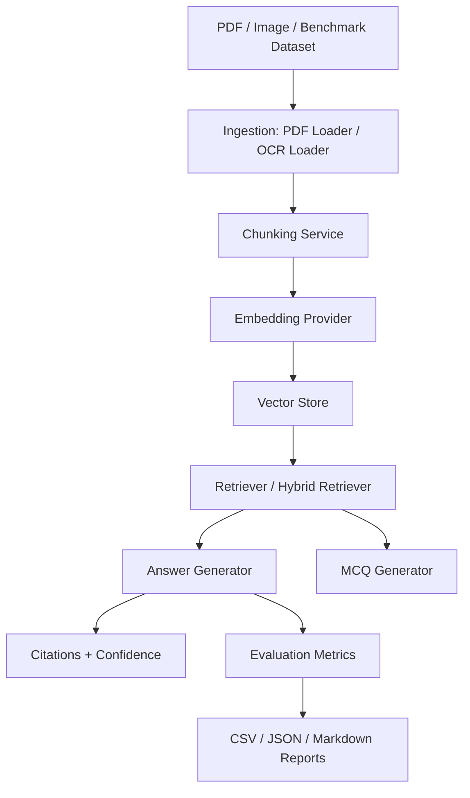

# Smart Study Assistant - RAG Research Platform

Smart Study Assistant is a university AI project that combines a PDF study assistant with a measurable Retrieval-Augmented Generation experimentation platform. Users can upload PDFs, ask grounded questions, inspect retrieved evidence, generate quizzes, run OCR on scanned material, and benchmark RAG configurations across chunking, embeddings, retrieval, vector stores, and generation modes.

The project is intentionally demo-friendly: the default path runs offline with deterministic mock embeddings and mock generation, while stronger local/paid providers can be enabled when dependencies and API keys are available.

## Why This Project Matters

Most PDF chatbots only answer questions. This project also measures whether the system retrieved the right evidence, cited its sources, stayed grounded, and how different RAG design choices affect quality and latency. That makes it useful both as an AI tutor prototype and as a small RAG research workbench.

## Main Features

- PDF upload and text extraction with PyMuPDF and pypdf fallback
- Optional OCR for scanned PDFs/images with PyMuPDF, Pillow, and pytesseract
- Configurable chunk size, overlap, and chunking strategies
- Embedding providers: `mock`, `minilm`, `e5`, `bge`, `sentence-transformers`, and optional `openai`
- Vector stores: persistent in-memory JSON store, FAISS, ChromaDB, and Qdrant wrappers
- Question answering over uploaded documents
- Grounded answers with source/page/chunk citations, confidence, and weak-context warnings
- MCQ/quiz generation with citations, JSON export, and Markdown export
- Local dataset and RAGBench/Open RAG Benchmark support
- Experiment runner with CSV, JSON diagnostics, and Markdown reports
- Retrieval diagnostics and metric explanations
- Streamlit UI for live demos
- Unit tests for chunking, embeddings, vector stores, retrieval, generation, OCR behavior, MCQs, and evaluation

## Architecture



## Folder Structure

```text
app/                 CLI and lightweight app entry points
core/                Shared models, config, errors, and types
ingestion/           PDF, OCR, and document loaders
chunking/            Chunking facades and strategies
embeddings/          Provider interface, mock, SentenceTransformers, OpenAI factory
vectorstores/        Memory, FAISS, Chroma, Qdrant backends
retrieval/           Retriever facades, hybrid retrieval, diagnostics
reranking/           Reranker interfaces and optional rerankers
generation/          Prompts, grounded answers, citations, MCQs, LLM wrappers
evaluation/          Metrics, evaluator aliases, benchmark runner, reports
datasets/            Local and RAGBench loader facades
services/            Backward-compatible service layer used by current CLI/tests
ui/                  Streamlit demo app
tests/               unittest suite
data/                Sample PDF and local evaluation data
experiments/results/ Generated benchmark outputs and quizzes
main_experiment.py   Main benchmark CLI
```

## Installation

```bash
python -m venv venv
source venv/bin/activate
python -m pip install -r requirements.txt
```

For OCR, install the Tesseract system binary as well as Python packages. On Ubuntu:

```bash
sudo apt-get install tesseract-ocr
python -m pip install Pillow pytesseract
```

Real local embedding models require `sentence-transformers` and a first-time model download. If those models are unavailable during a run, the app prints a clear warning and falls back to deterministic mock embeddings so the demo can continue. You can also choose `--embedding-provider mock` explicitly for a fully offline run.

```bash
python -m pip install sentence-transformers huggingface_hub
```

Optional vector database and API-backed providers can be installed only when needed:

```bash
python -m pip install faiss-cpu chromadb qdrant-client openai datasets
```

## Environment Variables

Create a `.env` file if you want API-backed providers:

```text
OPENAI_API_KEY=
GEMINI_API_KEY=
PERPLEXITY_API_KEY=
```

The basic demo does not require paid APIs.

## Run The Streamlit UI

```bash
python -m streamlit run ui/streamlit_app.py
```

Demo flow:

1. Open **Upload & Process**, use `data/example.pdf`, and process it with mock embeddings and the memory vector store.
2. Open **Ask Questions**, ask a question, and show the grounded answer plus citation cards.
3. Enable **Debug mode** in the sidebar to show retrieved chunks and scores.
4. Open **Generate Quiz**, create 5 or 10 MCQs, and review citations.
5. Open **OCR** for scanned PDFs/images if OCR dependencies are installed.
6. Open **Experiments** after running a benchmark.
7. Open **Retrieval Debug** to inspect chunk IDs, page numbers, metadata, and scores.

## Run Experiments

Local benchmark with the offline mock provider:

```bash
python main_experiment.py --dataset local --chunk-size 500 --overlap 50 --top-k 3 --embedding-provider mock
```

RAGBench/Open RAG Benchmark with a real local embedding provider:

```bash
python main_experiment.py --dataset ragbench --chunk-size 500 --overlap 50 --top-k 3 --embedding-provider minilm
```

By default, RAGBench runs only from local files so offline demos fail fast with a
clear message. To allow a Hugging Face download when `--open-rag-bench-path` is
missing, add `--download-ragbench`.

Grounded generation with citations and deterministic mock generation:

```bash
python main_experiment.py --dataset local --chunk-size 500 --overlap 50 --top-k 3 --generation-mode grounded_mock --show-citations
```

Hybrid retrieval with reranking:

```bash
python main_experiment.py --dataset local --retrieval-mode hybrid --reranker heuristic
```

Persistent memory vector store:

```bash
python main_experiment.py --dataset local --vector-store memory --vector-store-path experiments/results/local_vectors.json
```

Outputs are written to `experiments/results/`:

- `experiment_results.csv`
- `experiment_results.json`
- `experiment_summary.md`
- `ragbench_results.csv`
- `ragbench_results.json`
- `ragbench_summary.md`
- `quiz.json`
- `quiz.md`

Generated result files are ignored by Git, except for `experiments/results/.gitkeep`.

## Datasets

- `data/example.pdf`: sample PDF for demos
- `data/evaluation/eval_dataset.json`: local question-answer evaluation set
- RAGBench/Open RAG Benchmark: loaded from Hugging Face when available, or from a local downloaded directory passed with `--open-rag-bench-path`

If RAGBench cannot be downloaded because internet access is unavailable, the CLI fails gracefully and prints the local dataset path option.

## Metrics

- **Accuracy**: token-level F1 overlap between generated and expected answer
- **Precision@K**: fraction of retrieved chunks matching a labeled source span
- **Recall@K**: whether any top-K chunk contains the labeled source span
- **MRR**: reciprocal rank of the first relevant chunk
- **NDCG**: ranking quality for binary relevance labels
- **Grounding score**: answer-token overlap with retrieved context
- **Hallucination rate**: estimated ungrounded token rate
- **Citation coverage**: fraction of used chunks that were cited
- **Context usage rate**: fraction of retrieved chunks used by the generator
- **Response time**: retrieval and answer construction latency

When source labels are missing, retrieval metrics are reported as `not_available`/`null` per question instead of being treated as zero.

## Run Tests

```bash
python -m unittest discover tests
python -m compileall .
```

## Troubleshooting

- **`sentence-transformers is not installed`**: install requirements or use `--embedding-provider mock`.
- **Model download fails**: use mock embeddings for offline runs, or pre-download the model.
- **`OPENAI_API_KEY is missing`**: use mock generation/embeddings or set the key in your environment.
- **OCR returns dependency errors**: install `pytesseract`, `Pillow`, and the Tesseract system binary.
- **RAGBench fails to load online**: download Vectara Open RAG Benchmark locally and pass `--open-rag-bench-path`.
- **Optional vector DB import error**: install the backend package or use the default memory store.

## Current Limitations

- Mock embeddings are deterministic and reliable for smoke tests, but not semantically strong.
- RAGBench includes multimodal references; this project currently focuses on text/table text.
- The grounded mock generator is deterministic and extractive, not a polished tutor LLM.
- FAISS, Chroma, and Qdrant are optional wrappers and need their dependencies/services.
- Large benchmark runs rebuild embeddings per configuration, so they can be slow.

## Future Work

- Add stronger semantic evaluation such as BERTScore or LLM-as-judge rubrics
- Add streaming answer generation and richer tutor-style explanations
- Improve multimodal RAGBench support for image-heavy examples
- Add saved experiment comparison views in the UI
- Add Docker setup for one-command demos

## Presentation Script

See `DEMO.md` for a concise live-demo checklist.

1. Introduce the project as an AI tutor plus RAG research platform.
2. Upload `data/example.pdf` in Streamlit and process it.
3. Ask a question and show the answer with citations.
4. Expand retrieved chunks to explain grounding and retrieval scores.
5. Generate a 5-question quiz and show JSON/Markdown export.
6. Run a mock benchmark from the CLI.
7. Open `experiments/results/experiment_summary.md` and explain the best configuration, metrics, limitations, and next steps.
