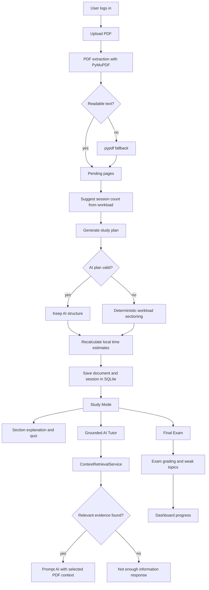

# Smart Study Assistant

**AI-powered study platform that transforms PDF documents into personalized, grounded learning workflows.**

[](https://www.python.org/)
[](https://streamlit.io/)
[](https://platform.openai.com/)
[](https://groq.com/)
[](https://www.sqlite.org/)
[](https://www.langchain.com/)
[](https://faiss.ai/)
[](#project-status)
[](#license)

Smart Study Assistant is a Streamlit application for students who want to study from their own PDFs without turning the whole document over to a generic chatbot. It extracts PDF text, builds structured study sessions, retrieves only relevant context for questions, generates quizzes and final exams, and tracks progress across saved sessions.

> Main workflow: **Upload PDF -> Generate Study Plan -> Study Sections -> Ask AI Tutor -> Practice Quizzes -> Final Exam -> Dashboard**

---

## Table Of Contents

- [Project Overview](#project-overview)
- [Features](#features)
- [Screenshots](#screenshots)
- [How It Works](#how-it-works)
- [Architecture](#architecture)
- [AI Components](#ai-components)
- [Study Plan Logic](#study-plan-logic)
- [Question Answering And Retrieval](#question-answering-and-retrieval)
- [Persistence, Authentication, And Progress](#persistence-authentication-and-progress)
- [Project Structure](#project-structure)
- [Technologies](#technologies)
- [Installation](#installation)
- [Running The Project](#running-the-project)
- [Testing](#testing)
- [Configuration](#configuration)
- [Research Module](#research-module)
- [Roadmap](#roadmap)
- [Project Status](#project-status)
- [License](#license)

---

## Project Overview

Modern AI chatbots are useful, but they are not automatically good study tools. If a student uploads course notes or a lecture PDF, a generic chatbot may:

- answer from outside knowledge instead of the assigned material;
- hallucinate unsupported claims;
- lose track of where an answer came from;
- provide one-off answers instead of a complete study workflow;
- ignore student progress, weak sections, quizzes, and review needs.

Smart Study Assistant solves this by treating the PDF as the source of truth. The app creates a guided learning loop around the uploaded document:

1. extract text from the PDF;
2. create explainable study sessions;
3. retrieve relevant local context for grounded answers;
4. generate quizzes and final exams from the material;
5. track completion, scores, weak topics, and study time.

The project philosophy is **AI-assisted, PDF-grounded, and deterministic where correctness matters**. AI is used for high-value generation tasks when an API key is available, but safety-critical behavior such as retrieval acceptance, fallback quiz generation, progress tracking, and time estimates is handled locally.

---

## Features

| Feature | Status | Description |
| --- | --- | --- |
| PDF upload | ✅ Implemented | Upload course PDFs through the Streamlit interface. |
| PDF text extraction | ✅ Implemented | Uses PyMuPDF first and falls back to pypdf. |
| PDF page rendering | ✅ Implemented | Renders selected pages as PNG previews in Study Mode. |
| Section PDF download | ✅ Implemented | Exports the current study section as a smaller PDF. |
| Automatic study plan | ✅ Implemented | Builds ordered study sessions with titles, summaries, objectives, concepts, difficulty, and time estimates. |
| Workload-based sectioning | ✅ Implemented | Groups pages by estimated study effort and natural headings when possible. |
| Explainable time estimates | ✅ Implemented | Calculates study time from word count, concepts, objectives, practice time, and difficulty. |
| AI study-plan enhancement | 🤖 Optional | Uses OpenAI or Groq to propose structure, then recalculates timing locally. |
| AI Tutor | 🤖 Optional | General tutor mode plus PDF-grounded question answering. |
| Local retrieval guardrails | ✅ Implemented | Retrieves only relevant chunks and rejects unsupported questions. |
| Chapter / section intent handling | ✅ Implemented | Handles requests such as "summarize chapter 4" with structural retrieval. |
| Quiz generation | ✅ Implemented | AI-generated multiple choice questions with deterministic fallback. |
| Quiz grading | ✅ Implemented | Grades multiple choice, true/false, and short-answer questions. |
| Final exam generation | ✅ Implemented | Generates mixed question exams with safe fallback behavior. |
| Exam grading and weak topics | ✅ Implemented | Scores final exams and maps weak topics back to sections. |
| Dashboard | ✅ Implemented | Shows progress, scores, study time, weak areas, and recommendations. |
| Authentication | ✅ Implemented | Local username/password accounts backed by SQLite. |
| Persistent sessions | ✅ Implemented | Saves PDF bytes, study sections, progress, quizzes, and exams locally. |
| Bilingual UI | ✅ Implemented | English and Hebrew interface with RTL support for Hebrew. |
| OCR | 🧪 Research only | OCR experiments exist under `research/`, but OCR is not part of the active Streamlit app. |
| LangChain / FAISS | 🧪 Research only | Present in the legacy/research module, not used by the main app workflow. |

---

## Screenshots

Add screenshots before submission or portfolio publishing:

| Upload | Study Plan | Study Mode |
| --- | --- | --- |
| `docs/screenshots/upload.png` | `docs/screenshots/study-plan.png` | `docs/screenshots/study-mode.png` |

| AI Tutor | Final Exam | Dashboard |
| --- | --- | --- |
| `docs/screenshots/ai-tutor.png` | `docs/screenshots/final-exam.png` | `docs/screenshots/dashboard.png` |

<details>
<summary>Suggested screenshot checklist</summary>

- Login screen
- PDF upload and session count selector
- Generated study plan with time explanations
- Study Mode with rendered PDF page and extracted text
- AI Tutor grounded answer with retrieved sources
- Quiz feedback
- Final exam results and weak-topic recommendation
- Dashboard progress summary

</details>

---

## How It Works



The app is intentionally modular: Streamlit pages collect user actions, `ui/workflow.py` orchestrates the application flow, and `services/` contains testable business logic.

---

## Architecture

### High-Level Layers

| Layer | Directory | Responsibilities |
| --- | --- | --- |
| UI shell | `ui/` | Streamlit entry point, navigation, state helpers, CSS, reusable components, workflow orchestration. |
| Pages | `pages/` | Upload, Study Plan, Study Mode, AI Tutor, Final Exam, Dashboard, and Auth screens. |
| Services | `services/` | PDF extraction, study planning, retrieval, AI calls, quizzes, exams, grading, persistence, authentication, progress. |
| Core models | `core/` | Shared document models such as `DocumentPage` and `DocumentChunk`. |
| Tests | `tests/` | MVP behavior, service logic, navigation, translations, recovery checks. |
| Documentation | `docs/` | Prompting/data-flow docs, proposal notes, implementation summaries. |
| Research | `research/` | Legacy/experimental RAG, LangChain, FAISS, vector stores, OCR, benchmarks. |

### Application Entry Point

The active app starts from:

```bash
streamlit run ui/streamlit_app.py
```

`ui/streamlit_app.py` initializes state, enforces login, renders navigation, and dispatches to page modules.

### Main Runtime Flow

| Module | Purpose | Main classes / functions |
| --- | --- | --- |
| `ui/streamlit_app.py` | Streamlit app entry point and page router | `main()`, `PAGE_RENDERERS` |
| `ui/workflow.py` | Coordinates upload, study-plan generation, Q&A, exams, persistence | `set_pending_pdf`, `answer_ai_tutor`, `generate_final_exam` |
| `ui/state.py` | Streamlit session state and persistence bridge | `init_state`, `persist_current_state`, `current_section` |
| `services/pdf_service.py` | Extracts text from PDFs | `PdfService`, `PdfExtractionError` |
| `services/study_service.py` | Generates study sessions and time estimates | `StudyService`, `StudySection` |
| `services/context_retrieval_service.py` | Local lexical retrieval and intent detection | `ContextRetrievalService` |
| `services/general_ai_service.py` | Provider selection and chat completion calls | `GeneralAIService`, `AIProvider` |
| `services/quiz_service.py` | Quiz generation with AI and deterministic fallback | `QuizService`, `QuizQuestion` |
| `services/exam_service.py` | Final exam generation and normalization | `ExamService`, `ExamOptions` |
| `services/exam_grading_service.py` | Final exam scoring and weak-topic mapping | `ExamGradingService` |
| `services/progress_service.py` | Progress state, timers, quiz averages | `ProgressService`, `ProgressState` |
| `services/database_service.py` | SQLite users, documents, sessions, progress | `DatabaseService` |
| `services/auth_service.py` | Registration, login, password hashing | `AuthService` |

---

## AI Components

The app supports optional AI providers:

1. `OPENAI_API_KEY` with `OPENAI_MODEL` defaulting to `gpt-4o-mini`
2. `GROQ_API_KEY` with `GROQ_MODEL` defaulting to `llama-3.1-8b-instant`
3. deterministic fallback or setup message when no provider is configured

### Study Plan Generator

`StudyService` can ask an AI provider to group pages into coherent study sessions. The AI response is accepted only if it is valid JSON and passes structural checks:

- exactly the requested number of sections;
- ordered, non-overlapping page ranges;
- page ranges inside the uploaded PDF;
- all readable pages covered;
- meaningful titles and summaries.

Even when the AI plan is valid, `estimated_minutes` is recalculated locally from the actual section text. The app does not trust AI-generated time estimates blindly.

### Context Retrieval Service

`ContextRetrievalService` performs local retrieval before any PDF-grounded answer is sent to the model. It:

- tokenizes and normalizes the user question;
- removes common and low-value words;
- computes IDF-like term weights across chunks;
- uses BM25-style scoring with length normalization;
- boosts exact phrase matches such as `gradient descent`;
- boosts section title and key-concept matches;
- rejects queries with no meaningful evidence;
- returns diagnostics such as matched tokens, unmatched tokens, phrase matches, score, threshold, and match reason.

### Question Answering

PDF-grounded prompts include only retrieved context, not the whole PDF. If retrieval does not find meaningful evidence, the app returns:

```text
The uploaded PDF does not contain enough information to answer this question.
```

This protects the "answer only from the PDF" guarantee.

### Quiz Generation

`QuizService` first attempts AI-generated multiple-choice questions from the current section context. If AI is unavailable or returns malformed JSON, it builds deterministic questions from extracted sentences and keywords.

### Final Exam Generation

`ExamService` builds a final exam prompt from broad study context and asks the configured provider for JSON. The response is normalized defensively. If generation fails, the service returns a fallback exam so the workflow remains usable.

### Short Answer Grading

Final exam short-answer grading uses deterministic checks first. If needed, `AIAnswerGradingService` can grade a short answer with the configured provider.

---

## Study Plan Logic

The study plan system is designed to be deterministic and explainable.

### Session Count

`StudyService.suggest_session_count(...)` estimates total study workload, then divides it by a target session length of approximately 30 minutes.

Example behavior:

| Estimated workload | Suggested sessions |
| --- | --- |
| 45 minutes | 2 |
| 90 minutes | 3 |
| 150 minutes | 5 |

Suggestions are clamped to avoid unreasonable counts and are capped by readable page count when appropriate. Users can still override the number before generating the final plan.

### Workload-Based Sectioning

When AI sectioning is unavailable or invalid, the fallback does not simply split pages evenly. It:

1. estimates workload per readable page;
2. detects natural boundaries from headings when reliable;
3. groups consecutive pages toward a target workload;
4. avoids empty sections;
5. merges tiny final sections into the previous section.

This makes one dense page count more than several short pages.

### Time Estimation

Each section receives a local time estimate using:

```text
reading_minutes = word_count / 160
concept_minutes = key_concepts * 2
objective_minutes = learning_objectives * 1.5
practice_minutes = 5

estimated_minutes =
  round_to_nearest_5(
    (reading_minutes + concept_minutes + objective_minutes + practice_minutes)
    * difficulty_multiplier
  )
```

Difficulty multipliers:

| Difficulty | Multiplier |
| --- | --- |
| Easy | 1.0 |
| Medium | 1.2 |
| Hard | 1.45 |

Normal sections are capped at 60 minutes. Very large sections can reach 90 minutes. The estimate metadata includes word count, component minutes, multiplier, workload score, and a human-readable explanation.

Example:

```text
Estimated 30 min: 18 min reading + 6 min concepts + 5 min practice, Medium difficulty.
```

---

## Question Answering And Retrieval

Smart Study Assistant separates general AI tutoring from PDF-grounded Q&A.

| Mode | Behavior |
| --- | --- |
| General AI Tutor | Uses AI provider without PDF citations and labels the answer as general mode. |
| PDF-grounded Q&A | Retrieves local PDF chunks first, then prompts AI only with selected context. |
| Chapter summary | Detects chapter references and retrieves chapter ranges or study-section fallback. |
| Section summary | Uses the requested study section directly. |
| Study plan request | Uses saved section metadata instead of random chunks. |
| Unsupported PDF question | Returns the not-enough-information message. |

### Retrieval Guardrails

The retriever accepts chunks only when there is meaningful evidence:

- score must pass a threshold;
- matched terms must be meaningful, not just stopwords;
- exact phrases and section metadata can boost confidence;
- noisy extra words do not destroy retrieval;
- unrelated questions do not return arbitrary fallback chunks.

For example, if a PDF contains `gradient descent`, these should retrieve the same relevant section:

```text
Explain gradient descent
Explain gradient descent please
Explain gradient descent banana
```

But this should be rejected:

```text
banana apple randomword
```

---

## Persistence, Authentication, And Progress

The active app uses local SQLite persistence through `.smartstudy.db`.

### Authentication

`AuthService` provides:

- username/password registration;
- login/logout;
- hashed passwords through Werkzeug when available;
- PBKDF2 fallback hashing when Werkzeug is unavailable.

Plain-text passwords are never stored.

### Saved Data

`DatabaseService` stores:

- users;
- uploaded documents and PDF bytes;
- study sessions;
- generated study sections;
- extracted section text;
- current section index;
- completed sections;
- quiz attempts and scores;
- final exam attempts and answers;
- weak-topic results;
- serialized progress state.

The older JSON persistence path in `PersistenceService` remains available as a lightweight local fallback.

### Progress Tracking

`ProgressService` tracks:

- completed sections;
- quiz scores;
- final exam score;
- weak topics;
- weak sections;
- actual study time;
- timer state.

---

## Project Structure

```text
SmartStudyAssistant/
├── README.md
├── requirements.txt
├── .env.example
├── translations.py
├── core/
│   ├── models.py
│   ├── config.py
│   ├── errors.py
│   └── types.py
├── ui/
│   ├── streamlit_app.py
│   ├── workflow.py
│   ├── state.py
│   ├── navigation.py
│   ├── components.py
│   └── styles.py
├── pages/
│   ├── auth_page.py
│   ├── upload_page.py
│   ├── study_plan_page.py
│   ├── study_mode_page.py
│   ├── ai_tutor_page.py
│   ├── final_exam_page.py
│   └── dashboard_page.py
├── services/
│   ├── auth_service.py
│   ├── database_service.py
│   ├── pdf_service.py
│   ├── pdf_render_service.py
│   ├── pdf_section_service.py
│   ├── study_service.py
│   ├── context_retrieval_service.py
│   ├── general_ai_service.py
│   ├── quiz_service.py
│   ├── quiz_grading_service.py
│   ├── exam_service.py
│   ├── exam_grading_service.py
│   ├── ai_answer_grading_service.py
│   ├── progress_service.py
│   ├── persistence_service.py
│   └── section_state_service.py
├── tests/
│   ├── test_core.py
│   ├── test_language_switch.py
│   ├── test_mvp_recovery.py
│   ├── test_navigation.py
│   └── test_translations.py
├── docs/
│   ├── AI_PROMPTING_AND_DATA_FLOW.md
│   ├── IMPLEMENTATION_CHANGES_SUMMARY.md
│   ├── project_proposal_outline.md
│   └── project_proposal_he.md
└── research/
    ├── app/
    ├── chunking/
    ├── embeddings/
    ├── evaluation/
    ├── generation/
    ├── ingestion/
    ├── rag/
    ├── retrieval/
    ├── reranking/
    ├── services/
    ├── vectorstores/
    └── tests/
```

---

## Technologies

| Technology | Purpose | Version / Source |
| --- | --- | --- |
| Python | Main programming language | 3.10+ recommended |
| Streamlit | Web UI | `streamlit>=1.28.0` |
| PyMuPDF | PDF extraction, rendering, section PDF export | `PyMuPDF>=1.24.2` |
| pypdf | PDF text extraction fallback | `pypdf>=4.0.0` |
| SQLite | Local user/session persistence | Python standard library |
| Werkzeug | Password hashing | `Werkzeug>=3.0.0` |
| OpenAI Python SDK | Optional AI provider | `openai>=1.3.0` |
| Groq OpenAI-compatible API | Optional AI provider | direct HTTP call |
| Mermaid | Documentation diagrams | GitHub Markdown rendering |
| unittest | Test runner | Python standard library |
| LangChain | Research-only RAG experiments | `research/requirements.txt` |
| FAISS | Research-only vector retrieval experiments | `research/requirements.txt` |
| pytesseract | Research-only OCR experiments | `research/requirements.txt` |

---

## Installation

### 1. Clone The Repository

```bash
git clone <your-repository-url>
cd SmartStudyAssistant
```

### 2. Create A Virtual Environment

macOS / Linux:

```bash
python3 -m venv .venv
source .venv/bin/activate
```

Windows PowerShell:

```powershell
python -m venv .venv
.\.venv\Scripts\Activate.ps1
```

### 3. Install Dependencies

```bash
pip install --upgrade pip
pip install -r requirements.txt
```

### 4. Configure Optional AI Keys

The app runs without AI keys, but AI study-plan generation, AI Tutor, AI quiz generation, final exam generation, and AI short-answer grading need a provider.

Create a local env file:

```bash
mkdir -p ui/.streamlit
cp .env.example ui/.streamlit/_env
```

Edit `ui/.streamlit/_env`:

```env
OPENAI_API_KEY=
OPENAI_MODEL=gpt-4o-mini

GROQ_API_KEY=
GROQ_MODEL=llama-3.1-8b-instant
```

Provider priority:

1. OpenAI if `OPENAI_API_KEY` is set
2. Groq if `GROQ_API_KEY` is set
3. deterministic fallback or setup message

### 5. Local Data Files

The app creates local files at runtime:

| File | Purpose |
| --- | --- |
| `.smartstudy.db` | SQLite users, uploaded PDFs, sessions, progress, quizzes, exams |
| `.smartstudy_progress.json` | Legacy/local JSON persistence fallback |
| `ui/.streamlit/_env` | Local API key configuration |

These files should usually not be committed.

---

## Running The Project

### Run Locally

```bash
streamlit run ui/streamlit_app.py
```

Then open the Streamlit URL shown in the terminal, usually:

```text
http://localhost:8501
```

### First-Time Use

1. Register a local username and password.
2. Upload a readable PDF.
3. Review the suggested number of sessions.
4. Generate the study plan.
5. Work through Study Mode, AI Tutor, quizzes, and the final exam.
6. Review progress in the Dashboard.

### Run Without AI Keys

The app still supports:

- login and saved sessions;
- PDF extraction;
- deterministic study-plan fallback;
- deterministic time estimates;
- section study workflow;
- deterministic quiz fallback;
- progress tracking;
- final exam fallback.

AI-specific features show a setup message or fall back safely.

---

## Testing

Run the main test suite:

```bash
python3 -m unittest tests.test_core
```

Run all tests:

```bash
python3 -m unittest discover
```

Compile the main application files:

```bash
python3 -m py_compile ui/*.py pages/*.py services/*.py core/*.py tests/*.py
```

<details>
<summary>Notes on local test environments</summary>

Some UI tests import Streamlit page modules. If `streamlit` is not installed in the active Python environment, full discovery may fail with `ModuleNotFoundError: No module named 'streamlit'`. Install `requirements.txt` in a virtual environment before running full discovery.

Unit tests mock AI providers and do not require real OpenAI or Groq API calls.

</details>

---

## Configuration

| Variable | Required | Default | Description |
| --- | --- | --- | --- |
| `OPENAI_API_KEY` | No | empty | Enables OpenAI-backed AI features. |
| `OPENAI_MODEL` | No | `gpt-4o-mini` | OpenAI chat model. |
| `GROQ_API_KEY` | No | empty | Enables Groq-backed AI features when OpenAI is unavailable. |
| `GROQ_MODEL` | No | `llama-3.1-8b-instant` | Groq model name. |
| `SMARTSTUDY_PROGRESS_PATH` | No | `.smartstudy_progress.json` | Optional path for legacy JSON persistence. |

`GeneralAIService` loads variables from `ui/.streamlit/_env` when present and does not overwrite environment variables already set by the shell.

---

## Research Module

The `research/` directory contains earlier and experimental RAG work. It is intentionally separated from the main student-facing app.

Research capabilities include:

- LangChain pipelines;
- FAISS / Chroma / Qdrant vector store experiments;
- embeddings and mock embedding providers;
- chunking strategies;
- retrieval and reranking experiments;
- benchmark/evaluation tooling;
- experimental OCR ingestion with pytesseract;
- research web/demo apps.

Install research dependencies only when working in that area:

```bash
pip install -r research/requirements.txt
```

The main Streamlit app does not require LangChain, FAISS, sentence-transformers, torch, or OCR dependencies.

---

## Documentation

| Document | Description |
| --- | --- |
| [AI_PROMPTING_AND_DATA_FLOW.md](docs/AI_PROMPTING_AND_DATA_FLOW.md) | Detailed prompting, context flow, fallback behavior, and persistence notes. |
| [IMPLEMENTATION_CHANGES_SUMMARY.md](docs/IMPLEMENTATION_CHANGES_SUMMARY.md) | Summary of major implementation changes. |
| [project_proposal_outline.md](docs/project_proposal_outline.md) | English project proposal outline. |
| [project_proposal_he.md](docs/project_proposal_he.md) | Hebrew project proposal. |

---

## Roadmap

- Add first-class OCR support to the active Streamlit app.
- Persist timing breakdown metadata in SQLite, not only JSON/session state.
- Add export options for study plans, quiz reports, and final exam reports.
- Add screenshot assets and a short demo video.
- Add end-to-end browser tests for the Streamlit workflow.
- Add richer analytics for weak concepts and repeated mistakes.
- Add optional semantic retrieval as a hybrid layer while keeping lexical guardrails.

---

## Project Status

This is an MVP / university final project. The active product workflow is stable enough for demonstration and portfolio review:

- user accounts and saved sessions are local;
- AI providers are optional;
- retrieval is local and explainable;
- research code is isolated from the main app;
- tests cover core behavior, recovery paths, retrieval, study planning, persistence, and translation logic.

---

## License

No license file is currently included in this repository. Add a license before publishing as open source.

---

## Acknowledgements

Built with Python, Streamlit, PyMuPDF, SQLite, and optional OpenAI/Groq integrations. The project also includes a research workspace for RAG experimentation with LangChain, FAISS, vector stores, reranking, and OCR.
