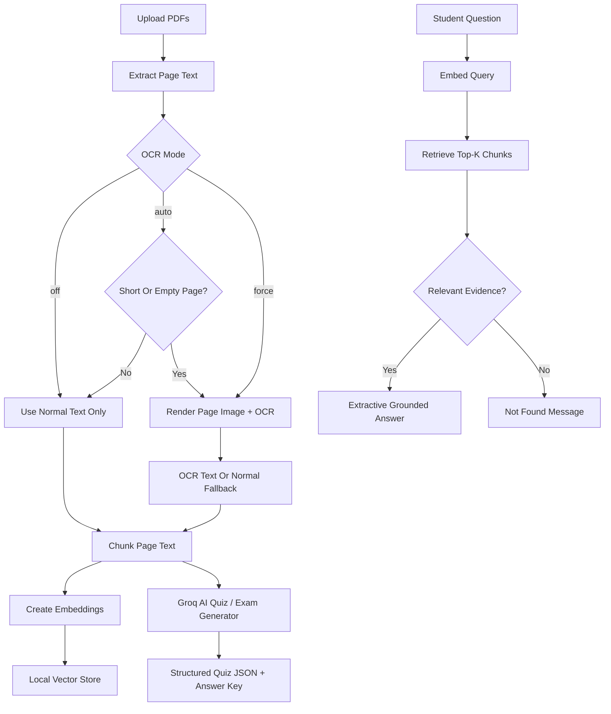

# Smart Study Assistant

Smart Study Assistant is a local PDF-based Retrieval-Augmented Generation
(RAG) study tool. It lets a student upload one or more PDF files, process those
documents into searchable chunks, ask questions grounded only in the uploaded
PDF content, inspect the retrieved source chunks, and generate an AI Quiz / Exam
from the processed documents.

The central rule of the project is strict grounding:

```text
The assistant answers only from uploaded PDF content.
```

If the requested information is not available in the uploaded PDFs, the app
returns this exact fallback answer:

```text
I could not find this information in the uploaded PDF.
```

Groq is used only for AI Quiz / Exam generation. PDF upload, text extraction,
chunking, embeddings, vector search, retrieval, and extractive question
answering are designed to run locally.

## What This Project Does

This project provides a complete study workflow for PDF documents:

1. Upload one or more PDF files.
2. Extract page text using normal PDF text extraction.
3. Optionally run local OCR for scanned or low-text pages.
4. Split extracted page text into overlapping chunks.
5. Create local embeddings for each chunk.
6. Store chunk vectors in a local vector store.
7. Retrieve the most relevant chunks for a student question.
8. Filter weak or unrelated retrieval results.
9. Generate a grounded, extractive answer using only retrieved chunks.
10. Show source references with PDF name, page number, chunk ID, score, and text.
11. Generate a Groq-powered AI Quiz / Exam from PDF chunks only.

The app is intentionally small and course-project friendly. It avoids a
database-backed production architecture and rebuilds the local index whenever
documents are processed.

## Problem It Solves

Students often study from lecture slides, notes, textbook chapters, and papers.
General-purpose chatbots can answer from outside knowledge, which makes it hard
to know whether an answer came from the course material.

Smart Study Assistant solves that by keeping answers grounded in uploaded PDFs.
When an answer is found, the student can inspect the source chunks. When an
answer is not found, the assistant clearly says so instead of guessing.

## Main Features

- Upload and process one or more PDF files.
- Extract normal PDF text with PyMuPDF.
- Fall back to pypdf when normal extraction is used and PyMuPDF fails.
- Run local OCR with Tesseract through pytesseract when enabled.
- Optionally try EasyOCR for difficult pages when EasyOCR is installed.
- Support OCR modes: `auto`, `off`, and `force`.
- Chunk pages with a recursive character strategy and overlap.
- Generate MiniLM embeddings locally with SentenceTransformers.
- Fall back to deterministic mock embeddings when the configured embedding
  provider is unavailable.
- Cache embeddings in `.cache/embeddings.sqlite3`.
- Store vectors in FAISS by default, with an in-memory backend also available.
- Ask questions against retrieved PDF chunks only.
- Return source references for grounded answers.
- Return a clear not-found answer when evidence is weak or missing.
- Generate an AI Quiz / Exam with Groq using PDF chunks only.
- Support multiple-choice, true/false, short-answer, and open questions.
- Include answer keys, difficulty labels, and source references in generated
  quizzes or exams.
- Provide a Streamlit UI, a command-line smoke demo, and a lightweight JSON API.

## Architecture



## How RAG Works Here

### 1. PDF Upload

The user uploads one or more PDFs through Streamlit or the JSON API. Uploaded
files are written to a temporary directory only while they are being processed.
The app does not persist uploaded files.

### 2. Text Extraction

`PdfService` extracts text page by page.

The normal extraction path uses PyMuPDF first:

```text
PDF file -> PyMuPDF page text -> DocumentPage objects
```

If OCR is disabled and PyMuPDF fails, the service falls back to pypdf.

Each extracted page becomes a `DocumentPage` with:

- `page_number`
- `text`
- `source_id`
- metadata such as extraction method and OCR mode

### 3. OCR

OCR is local and free. It is controlled by `ocr_mode`.

- `auto`: default mode. Normal PDF text is used first. OCR is attempted only on
  pages with fewer than 25 extracted characters.
- `off`: OCR is never attempted.
- `force`: OCR is attempted for every page.

OCR uses Tesseract through `pytesseract`. If Tesseract returns very little text
and EasyOCR is installed, the service tries EasyOCR as a fallback.

### 4. Chunking

`ChunkService` normalizes page text and splits it into overlapping chunks using
the configured chunking strategy.

Default settings:

```text
CHUNK_SIZE=700
CHUNK_OVERLAP=100
```

Each chunk becomes a `DocumentChunk` with:

- `chunk_id`
- `page_number`
- `text`
- `source_id`
- character offsets where available
- parent chunk information where available
- metadata from extraction and chunking

Chunk IDs include the source PDF name, page number, and chunk number. Example:

```text
lecture_notes_page_3_chunk_2
```

### 5. Embeddings

`EmbeddingService` creates embeddings for chunks and questions.

Default embedding configuration:

```text
EMBEDDING_PROVIDER=minilm
EMBEDDING_MODEL=sentence-transformers/all-MiniLM-L6-v2
```

MiniLM embeddings are local through SentenceTransformers. If the model or
provider cannot be loaded and fallback is enabled, the service switches to a
deterministic mock embedding provider. Mock embeddings are useful for tests and
offline demos, but they are not as semantically meaningful as MiniLM.

### 6. Vector Storage

The default vector backend is FAISS:

```text
VECTOR_STORE_BACKEND=faiss
```

The app also supports an in-memory backend:

```text
VECTOR_STORE_BACKEND=memory
```

The current implementation keeps the vector store local and temporary. The
index is rebuilt when PDFs are processed and is lost after the app restarts.

### 7. Retrieval

`RetrievalService` embeds the user question and searches the vector store for
the top matching chunks.

Default retrieval settings:

```text
RETRIEVAL_TOP_K=4
MIN_RETRIEVAL_SCORE=0.08
```

After vector search, `PDFRAGService` applies a relevance check:

- the retrieval score must be at least `MIN_RETRIEVAL_SCORE`
- the question and retrieved chunk must share meaningful keywords

This helps prevent unrelated chunks from producing unsupported answers.

### 8. Grounded Answering

Question answering is extractive. The app does not call Groq or another hosted
LLM to answer normal PDF questions.

When relevant chunks are found, the service selects high-overlap sentences from
the retrieved chunks and returns them with PDF and page citations.

When no relevant evidence passes the filter, it returns:

```text
I could not find this information in the uploaded PDF.
```

### 9. AI Quiz / Exam Generation

`FullExamService` generates quiz or exam JSON using Groq's OpenAI-compatible
chat completions API.

The prompt instructs Groq to:

- use only retrieved PDF chunks
- avoid outside knowledge
- create questions based on specific PDF content
- include source references where possible
- return valid JSON only

The Groq model defaults to:

```text
llama-3.1-8b-instant
```

Generated exams can include:

- multiple-choice questions
- true/false questions
- short-answer questions
- open questions
- difficulty labels
- answer key entries
- source references with page number and chunk ID

## Project Structure

```text
app/
  main.py              CLI smoke demo
  web.py               Lightweight JSON API

chunking/
  strategies.py        Chunking strategy implementation
  text_splitter.py     Text splitting helpers

config/
  groq_api_key_example.txt

core/
  config.py            Environment defaults and Groq key loading
  models.py            DocumentPage and DocumentChunk dataclasses

embeddings/
  base.py              Embedding provider base types
  factory.py           Provider factory helpers
  mock_provider.py     Deterministic offline embedding provider
  providers.py         Embedding provider registry
  sentence_transformer_provider.py
                       Local SentenceTransformers provider

services/
  chunk_service.py     Page-to-chunk service
  embedding_service.py Embedding service wrapper and fallback handling
  exam_service.py      Groq AI Quiz / Exam generation
  pdf_service.py       PDF extraction and OCR service
  rag_service.py       End-to-end PDF RAG pipeline
  retrieval_service.py Query embedding and vector search
  vector_store_service.py
                       Shared vector search result models

ui/
  streamlit_app.py     Streamlit user interface

vectorstores/
  base.py              Vector store base class
  factory.py           Vector store backend factory
  faiss_store.py       FAISS vector store
  memory.py            In-memory vector store

tests/
  test_chunking.py
  test_embeddings.py
  test_exam_service.py
  test_pdf_service.py
  test_rag_service.py
  test_retrieval.py
  test_vectorstores.py

data/
  Sample PDFs
```

## Installation

Create and activate a virtual environment:

```bash
python -m venv venv
source venv/bin/activate
```

Install project dependencies:

```bash
python -m pip install -r requirements.txt
```

## OCR Setup

Python OCR packages are listed in `requirements.txt`, including:

```bash
python -m pip install pytesseract Pillow
```

You also need the local Tesseract binary installed on your system.

Ubuntu or Debian:

```bash
sudo apt-get install tesseract-ocr
```

macOS with Homebrew:

```bash
brew install tesseract
```

Optional EasyOCR support:

```bash
python -m pip install easyocr
```

OCR quality depends on the input document. Scanned pages, handwriting, low
contrast, rotated text, math notation, and crowded margins can reduce accuracy.

## Groq Setup

Groq is required only for AI Quiz / Exam generation. The rest of the app can run
without a Groq key.

Copy the example key file:

```bash
cp config/groq_api_key_example.txt config/groq_api_key.txt
```

Edit `config/groq_api_key.txt` and add either:

```text
GROQ_API_KEY=your-groq-api-key
```

or just the raw key:

```text
your-groq-api-key
```

The real key file is ignored by Git.

If the key is missing, quiz/exam generation returns a clear missing-key error.
If the free API limit is reached, the app shows:

```text
Groq free API limit reached. Please try again later or reduce the number of questions.
```

## Configuration

Copy `.env.example` to `.env` or export variables in your shell if you want to
tune the app.

Important defaults:

```text
GROQ_MODEL=llama-3.1-8b-instant
EMBEDDING_PROVIDER=minilm
EMBEDDING_MODEL=sentence-transformers/all-MiniLM-L6-v2
VECTOR_STORE_BACKEND=faiss
CHUNK_SIZE=700
CHUNK_OVERLAP=100
RETRIEVAL_TOP_K=4
MIN_RETRIEVAL_SCORE=0.08
LLM_TEMPERATURE=0.2
LLM_MAX_TOKENS=2200
```

Supported vector backends:

```text
faiss
memory
```

Supported OCR modes:

```text
auto
off
force
```

Supported quiz/exam question types:

```text
multiple_choice
true_false
short_answer
open_question
```

Supported quiz/exam difficulties:

```text
easy
medium
hard
mixed
```

## Run Locally

### Streamlit UI

```bash
python -m streamlit run ui/streamlit_app.py
```

The UI includes four tabs:

- `Upload PDF`: upload one or more PDFs, choose OCR mode, process documents,
  and inspect processing summaries.
- `Ask from PDF`: ask grounded questions against the processed PDFs.
- `Generate AI Quiz / Exam`: generate quiz/exam JSON with Groq.
- `View Sources`: inspect retrieved chunks from the latest question.

### CLI Smoke Demo

```bash
python -m app.main
```

This is a lightweight command-line entry point for quickly checking that the
project imports and basic pipeline pieces are available.

### JSON API

```bash
python -m app.web
```

The API starts at:

```text
http://127.0.0.1:8000
```

The API keeps one processed index in memory. Uploading new PDFs replaces the
current index.

## API Reference

### Health

```http
GET /health
```

Response:

```json
{
  "ok": true
}
```

### Status

```http
GET /api/status
```

Response before upload:

```json
{
  "ok": true,
  "indexed": false
}
```

Response after upload:

```json
{
  "ok": true,
  "indexed": true,
  "index": {
    "pdf_name": "notes.pdf",
    "pages": 12,
    "chunks": 34,
    "extraction": {
      "ocr_mode": "auto",
      "pages_processed": 12,
      "pages_using_normal_text": 11,
      "pages_using_ocr": 1,
      "total_characters_extracted": 24500
    },
    "embedding_provider": "minilm",
    "embedding_model": "sentence-transformers/all-MiniLM-L6-v2",
    "vector_store": "faiss",
    "vector_store_note": "In-memory only; upload again after restarting the app."
  }
}
```

### Upload PDFs

```http
POST /api/upload
```

Multipart form upload:

```bash
curl -X POST http://127.0.0.1:8000/api/upload \
  -F "ocr_mode=auto" \
  -F "file=@notes.pdf" \
  -F "file=@chapter.pdf"
```

Single-file JSON upload:

```json
{
  "filename": "notes.pdf",
  "pdf_base64": "base64-encoded-pdf",
  "ocr_mode": "auto"
}
```

Multi-file JSON upload:

```json
{
  "ocr_mode": "auto",
  "files": [
    {
      "filename": "notes.pdf",
      "pdf_base64": "base64-encoded-pdf"
    },
    {
      "filename": "chapter.pdf",
      "pdf_base64": "base64-encoded-pdf"
    }
  ]
}
```

Successful response:

```json
{
  "ok": true,
  "index": {
    "pdf_name": "2 PDFs: notes.pdf, chapter.pdf",
    "pages": 20,
    "chunks": 58
  }
}
```

### Ask A Question

```http
POST /api/ask
```

Request:

```json
{
  "question": "What is dynamic programming?"
}
```

Grounded response:

```json
{
  "question": "What is dynamic programming?",
  "answer": "Dynamic programming is described as ... (notes.pdf, page 4)",
  "found": true,
  "confidence": 0.4132,
  "sources": [
    {
      "pdf_name": "notes.pdf",
      "page_number": 4,
      "chunk_id": "notes_page_4_chunk_1",
      "score": 0.4132,
      "text": "Retrieved source chunk text..."
    }
  ]
}
```

Not-found response:

```json
{
  "question": "Who won the Super Bowl?",
  "answer": "I could not find this information in the uploaded PDF.",
  "found": false,
  "confidence": 0.0,
  "sources": []
}
```

### Generate AI Quiz / Exam

Supported routes:

```http
POST /api/generate-exam
POST /api/generate-quiz
POST /generate-exam
POST /generate-quiz
POST /api/exam
```

Request:

```json
{
  "number_of_questions": 8,
  "question_types": [
    "multiple_choice",
    "true_false",
    "short_answer",
    "open_question"
  ],
  "difficulty": "mixed",
  "include_answer_key": true
}
```

Backward-compatible count fields are also supported:

```json
{
  "multiple_choice": 4,
  "true_false": 2,
  "short_answer": 2,
  "open_questions": 1,
  "difficulty": "medium",
  "include_answer_key": true
}
```

Response:

```json
{
  "ok": true,
  "exam": {
    "title": "AI Quiz / Exam",
    "pdf_name": "notes.pdf",
    "grounding": "Use only uploaded PDF context",
    "questions": [
      {
        "id": 1,
        "type": "multiple_choice",
        "difficulty": "medium",
        "question": "Which statement is supported by the PDF?",
        "options": [
          "Option A",
          "Option B",
          "Option C",
          "Option D"
        ],
        "answer": "Option A",
        "source_references": [
          {
            "page_number": 3,
            "chunk_id": "notes_page_3_chunk_1"
          }
        ]
      }
    ],
    "answer_key": [
      {
        "id": 1,
        "answer": "Option A",
        "source_references": [
          {
            "page_number": 3,
            "chunk_id": "notes_page_3_chunk_1"
          }
        ]
      }
    ],
    "fallback_used": false
  }
}
```

### Sources

```http
GET /api/sources
```

Returns all chunks in the current processed index:

```json
{
  "pdf_name": "notes.pdf",
  "chunks": [
    {
      "pdf_name": "notes.pdf",
      "page_number": 1,
      "chunk_id": "notes_page_1_chunk_1",
      "text": "Chunk text..."
    }
  ]
}
```

## Manual Verification Workflow

Use this checklist to verify the system manually:

1. Start the Streamlit app.
2. Upload one or more local PDFs.
3. Process a normal text PDF with OCR mode `auto`.
4. Confirm the processing summary shows pages, chunks, extraction mode, and
   total extracted characters.
5. Ask a question that is answered in the PDF.
6. Confirm the answer cites source chunks and page numbers.
7. Ask a question unrelated to the PDF.
8. Confirm the answer is exactly:

```text
I could not find this information in the uploaded PDF.
```

9. Upload a scanned PDF with OCR mode `auto`.
10. Confirm the extraction summary shows OCR pages when needed.
11. Upload a handwritten PDF if available and inspect source chunks for OCR
    mistakes.
12. Add a Groq key to `config/groq_api_key.txt`.
13. Generate an AI Quiz / Exam.
14. Confirm the response includes supported question types, difficulty labels,
    answer key entries if requested, and source references.
15. Remove or rename `config/groq_api_key.txt`.
16. Confirm quiz/exam generation shows a clear missing-key error.
17. Open `View Sources` after asking a question and inspect retrieved chunks.

## Tests

Run unit tests:

```bash
python -m unittest discover tests
```

Run compile checks:

```bash
python -m compileall app core services ui tests vectorstores embeddings chunking
```

The test suite covers:

- chunking behavior
- embedding service behavior
- PDF extraction behavior
- RAG service behavior
- retrieval behavior
- vector store behavior
- exam service behavior

## Error Handling

The project returns clear errors for common failure cases:

- uploading an empty file
- uploading a non-PDF file
- using an invalid OCR mode
- extracting a PDF with no text and no usable OCR output
- asking a question before uploading PDFs
- asking an empty question
- requesting quiz/exam generation before processing PDFs
- missing Groq API key
- Groq rate limit or quota errors
- unsupported vector store backend
- invalid chunking settings

## Security And Privacy Notes

- Uploaded PDFs are processed locally and stored only in a temporary directory
  during indexing.
- The vector index is local and temporary.
- Normal question answering does not send PDF content to Groq.
- AI Quiz / Exam generation sends selected PDF chunks to Groq.
- The Groq API key should be stored in `config/groq_api_key.txt`, which is
  ignored by Git.

## Known Limitations

- The vector store is not persistent. Restarting the app requires processing
  PDFs again.
- MiniLM model files may need to download the first time unless already cached.
- Mock embeddings are useful for tests but are weaker than real semantic
  embeddings.
- OCR quality depends on scan quality and the local OCR engine.
- Handwritten OCR can be incomplete or inaccurate.
- The not-found check combines vector score and keyword overlap, so it favors
  questions that use wording close to the document.
- Normal PDF question answering is extractive, not generative.
- AI Quiz / Exam generation requires `config/groq_api_key.txt`.
- Generated quiz quality depends on the retrieved context and Groq response.

## Future Improvements

- Add persistent document indexes.
- Add export formats for quizzes and exams beyond JSON.
- Add stronger semantic embeddings as an optional default.
- Add reranking for improved source selection.
- Add per-document filtering when multiple PDFs are uploaded.
- Add user-facing controls for retrieval top-k and minimum score.
- Add persistent upload history.
- Add richer citation formatting in the UI.
